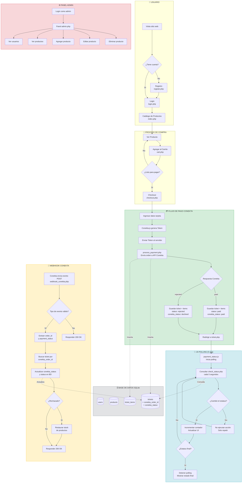
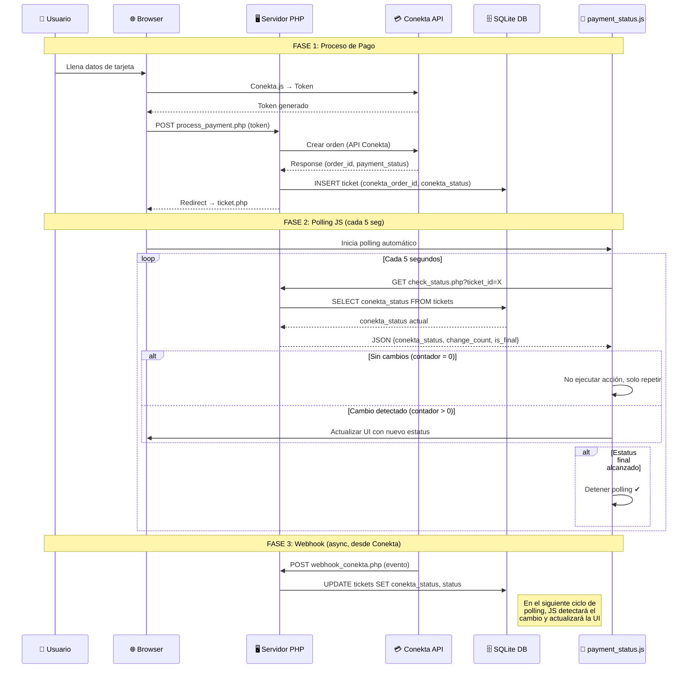

# Diagrama de Funcionalidad Completa - FashionHub (TiendaRopa)

## Flujo General del Sitio Web

## Flujo del Webhook + Polling (Detallado)

## Estructura de Archivos

| Archivo | Tipo | Descripción |
|---------|------|-------------|
| `index.php` | Página | Catálogo de productos |
| `login.php` | Página | Inicio de sesión |
| `register.php` | Página | Registro de usuarios |
| `cart.php` | Página | Carrito de compras |
| `checkout.php` | Página | Formulario de pago Conekta |
| `process_payment.php` | Backend | Procesa pago y guarda orden con datos Conekta |
| `ticket.php` | Página | Recibo con estatus Conekta en tiempo real |
| `webhook_conekta.php` | **Webhook** | Recibe notificaciones de Conekta |
| `check_status.php` | **API** | Endpoint para polling JS |
| `payment_status.js` | **JS** | Polling cada 5s con contador de cambios |
| `admin.php` | Admin | Panel de administración |
| `db.php` | Config | Conexión SQLite |
| `schema.sql` | DB | Esquema de base de datos |
| `style.css` | CSS | Estilos globales |
